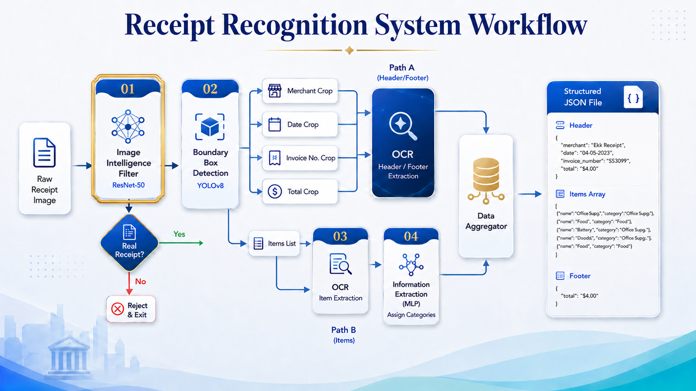

# Receipt Recognition System

**Convert receipt images into structured financial data (JSON)**
The Receipt Recognition System serves as the primary engine for extracting financial data, transforming raw paper receipts into structured digital information. This system relies on a sophisticated processing pipeline that begins with image filtering, proceeds to spatial localization, and culminates in advanced text extraction and product classification. The following figure illustrates the integrated workflow of the system, ensuring high precision in processing multilingual receipts (Arabic and English)



---

## Core Concept

The system transforms a **receipt image** into **organized data** containing:

- Invoice Information (store, date, number)
- Product List with Prices
- Subtotal, Tax & Total

**Use Cases:**

- POS Systems in Retail Stores
- Personal Expense Management Apps
- Financial Data Analysis
- Accounting Automation

---

## How It Works

```
Receipt Image
    ↓
[1️⃣] Type Validation         ← Is this actually a receipt?
    ↓
[2️⃣] Region Detection        ← Where are the important texts?
    ↓
[3️⃣] Text Extraction         ← Read what's in the image
    ↓
[4️⃣] Product Classification  ← What type is each product?
    ↓
Structured JSON (Organized Data)
```

---

#The 4 Intelligent Stages

### Stage 1️⃣: Image Validation (ResNet-50)

**Question:** "Is this a receipt?"

- **Accuracy:** 98.83%
- **Input:** Any image (448×448 pixels)
- **Output:** Receipt / Menu / Invalid
- **Speed:** 0.3 seconds
- [Details & Training](https://github.com/OmarHKhalil/Deep-Learning-Projects/tree/main/Invoice_Classification)

### Stage 2️⃣: Region Detection (YOLOv8m)

**Question:** "Where are the important areas?"

- **Detects:** Total Amount, Items List, Date, Invoice #, Store Name
- **Performance:** 0.7693 mAP50 (Best model)
- **Output:** Cropped images of each region
- **Speed:** 0.8 seconds
- [Details & Experiments](https://github.com/OmarHKhalil/Deep-Learning-Projects/tree/main/Receipt_Object_Detection)

### Stage 3️⃣: Text Extraction (Gemini 2.5-Flash)

**Question:** "What text is in each region?"

- **Engine:** Google Gemini API (Vision-Language Model)
- **Features:**
  - Reads Arabic & English perfectly
  - Handles blurry/thermal prints
  - Outputs structured JSON
- **Speed:** 5-15 seconds (API call)
- [Prompt Template](app/prompts.py)

### Stage 4️⃣: Product Classification (MLP Neural Network)

**Question:** "What category is each product?"

- **Categories:** 15 types (Beverages, Dairy, Meat, Electronics, etc.)
- **Accuracy:** 0.93 F1-Score
- **Features:** TF-IDF
- [Details & Models](https://github.com/OmarHKhalil/Machine-Learning-Projects/tree/main/Information_Extraction)

---

## Project Structure

```
Receipt_Recognition/
├── README.md                         ← You are here!
├── requirements.txt                  ← Python packages
├── run.py                            ← Quick runner script
│
├── app/                              ← FastAPI Application
│   ├── main.py                          ← REST API + Async Workers
│   ├── config.py                        ← API Keys Configuration
│   └── prompts.py                       ← LLM Prompt Templates
│
├── services/                         ← Core Processing Logic
│   ├── image_classification.py          ← Stage 1 (ResNet-50)
│   ├── yolo_service.py                  ← Stage 2 (YOLOv8m)
│   ├── item_api.py                      ← Stage 3 (Gemini - Items)
│   ├── meta_api.py                      ← Stage 3 (Gemini - Header/Footer)
│   └── Information_Extraction.py        ← Stage 4 (MLP Classifier)
│
├── model/                            ← Pre-trained Models
│   ├── Invoice_Classification.pth       ← ResNet-50 (98.2 MB)
│   ├── best.pt                          ← YOLOv8m (49.5 MB)
│   └── MLP_Model.joblib                 ← Classifier (2.3 MB)
│
├── utils/
│   └── json_utils.py                    ← JSON Parser
│
├── Images/
│   └── Receipt_Recognition.png          ← Workflow Diagram
│
└── Test/                             ← Test Cases & Samples
```

---

## Installation & Setup

### Prerequisites

- **Python:** 3.11+ (tested on 3.12.4)
- **GPU** (optional): CUDA 11.8+ for faster processing
- **API Keys:** Get from https://makersuite.google.com/app/apikey

### Step 1: Download & Navigate

```bash
# Clone or navigate to project
cd Receipt_Recognition

# Or if cloning:
git clone https://github.com/OmarHKhalil/Receipt_Recognition.git
cd Receipt_Recognition
```

### 🔧 Step 2: Create Python Environment

**Option A - Using Conda (Recommended):**

```bash
conda create --prefix ./env python=3.12.4 -y
conda activate ./env
```

**Option B - Using venv:**

```bash
python -m venv env

# Activate on Windows:
env\Scripts\activate

# Activate on Linux/Mac:
source env/bin/activate
```

### Step 3: Install Dependencies

```bash
pip install -r requirements.txt
```

### Step 4: Configure API Keys

Edit `app/config.py` and add your Gemini API keys:

```python
# app/config.py
GEMINI_API_KEY_META1 = "your_api_key_here"
GEMINI_API_KEY_META2 = "your_api_key_here"
GEMINI_API_KEY_ITEMS1 = "your_api_key_here"
GEMINI_API_KEY_ITEMS2 = "your_api_key_here"
# ... add more keys if needed
```

**Why multiple keys?** To avoid hitting Google's rate limits when processing many receipts simultaneously.

### Step 5: Start the Server

```bash
# Simple start
uvicorn app.main:app --reload

# Or with specific host/port
python -m uvicorn app.main:app --reload --host 0.0.0.0 --port 8000
```

**Expected Output:**

```
✅ W_Item_K1_1 online and ready
✅ W_Item_K1_2 online and ready
✅ W_Meta_K1_1 online and ready
🚀 All 12 workers are active
INFO: Uvicorn running on http://127.0.0.1:8000
```

Visit **http://localhost:8000/docs** for interactive API documentation

---

## API Usage

### Send a Receipt for Processing

```bash
curl -X POST "http://localhost:8000/process" \
  -H "accept: application/json" \
  -F "file=@receipt.jpg"
```

### Example Response

```json
{
  "header": {
    "store_name": "Walmart Supercenter",
    "date": "2024-06-27",
    "invoice_number": "INV-456789"
  },
  "items": [
    {
      "name": "Apples",
      "quantity": 5,
      "unit_price": 1.5,
      "total_price": 7.5,
      "category": "Fruits & Vegetables",
      "confidence": 0.95
    },
    {
      "name": "Milk (2L)",
      "quantity": 1,
      "unit_price": 3.99,
      "total_price": 3.99,
      "category": "Dairy & Eggs",
      "confidence": 0.92
    }
  ],
  "footer": {
    "subtotal": 11.49,
    "tax": 0.92,
    "total": 12.41
  }
}
```

---

## Download Pre-trained Models

Pre-trained models are already in `model/` folder:

```
model/
├── Invoice_Classification.pth    (98.2 MB)  [ResNet-50]
├── best.pt                       (49.5 MB)  [YOLOv8m]
└── MLP_Model.joblib              (2.3 MB)   [Classifier]
```

---

## Related Repositories

This project uses models from three specialized projects:

### 1. Invoice Classification (Stage 1)

**Repo:** [OmarHKhalil/Deep-Learning-Projects/Invoice_Classification](https://github.com/OmarHKhalil/Deep-Learning-Projects/tree/main/Invoice_Classification)

- ResNet-50 model training
- Dataset: 4,200 images (Receipts, Menus, Invalid)
- Training scripts & evaluation metrics

### 2. Receipt Object Detection (Stage 2)

**Repo:** [OmarHKhalil/Deep-Learning-Projects/Receipt_Object_Detection](https://github.com/OmarHKhalil/Deep-Learning-Projects/tree/main/Receipt_Object_Detection)

- YOLOv8 bounding box detection
- 5 experimental training configurations
- Dataset: 8,439 annotated ReceiptSense images
- Performance visualization & metrics

### 3. Information Extraction (Stage 4)

**Repo:** [OmarHKhalil/Machine-Learning-Projects/Information_Extraction](https://github.com/OmarHKhalil/Machine-Learning-Projects/tree/main/Information_Extraction)

- MLP, SVM, KNN, Random Forest classifiers
- TF-IDF feature engineering
- Dataset: 13,323 product samples
- Model comparison & benchmarking

---

## Product Categories (15 Types)

The system can classify items into:

1. **Beverages** - Coffee, Tea, Juice, Soda
2. **Bakery & Breakfast** - Bread, Pastries, Cereals
3. **Snacks & Sweets** - Candy, Chips, Cookies
4. **Fruits & Vegetables** - Fresh produce
5. **Meat & Poultry** - Beef, Chicken, Fish
6. **Dairy & Eggs** - Milk, Cheese, Yogurt
7. **Pantry & Cooking** - Rice, Pasta, Oil, Spices
8. **Household & Cleaning** - Soap, Detergent, Sanitizer
9. **Personal Care** - Shampoo, Lotion, Toothpaste
10. **Baby Products** - Diapers, Formula, Toys
11. **Office & Stationery** - Paper, Pens, Notebooks
12. **Home & Furniture** - Decor, Small appliances
13. **Electronics** - Phone accessories, USB cables
14. **Fast Food** - Ready-to-eat meals
15. **Juices & Cocktails** - Fresh/bottled beverages

---

## Author

- Developed by: Omar Hafez Khalil
- GitHub: [OmarHKhalil](https://github.com/OmarHKhalil)
- LinkedIn: [Omar Khalil](https://www.linkedin.com/in/omar-khalil-55a674281)
